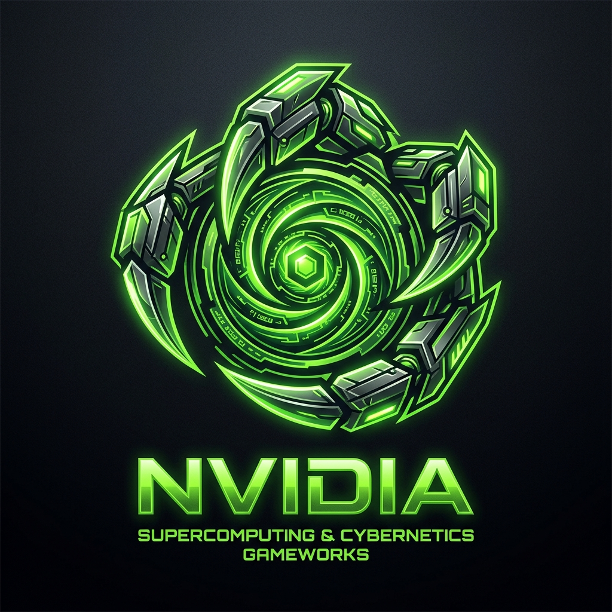
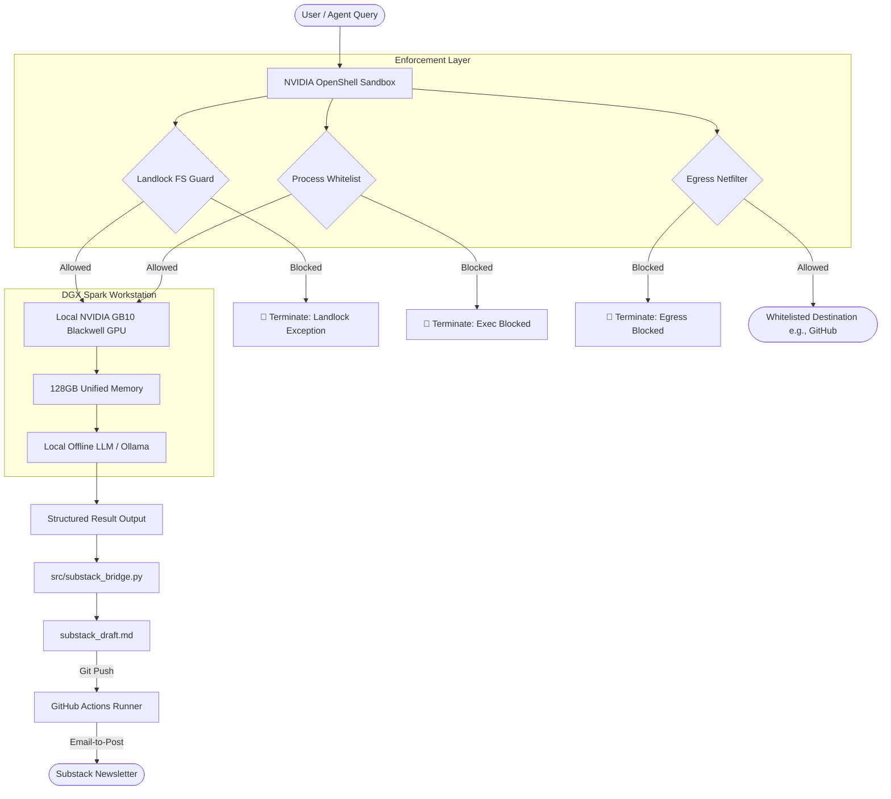

# NVIDIA DGX Spark & OpenShell Agent Bootstrap Kit

<p align="center">
  
</p>

🚀 **The Zero-Token Desktop AI & Data Science Supercomputer Setup.**

This repository is a developer-focused bootstrap kit for building, testing, and deploying secure, autonomous AI agents locally on **NVIDIA DGX Spark** workstations utilizing the **NVIDIA OpenShell** sandboxed runtime.

👉 **[Launch the Interactive OpenShell Sandbox & Telemetry Portal Live!](https://karidasd.github.io/nvidia-openshell-agent-bootstrap/)**

> [!IMPORTANT]
> **Disclaimer**: This is an independent, community-driven open-source project. It is not affiliated with, sponsored by, or endorsed by NVIDIA Corporation. NVIDIA, DGX, Grace Blackwell, and OpenShell are trademarks of NVIDIA Corporation.

---

## 💡 The Problem: Cloud Token Costs & Data Exfiltration Risks

When deploying autonomous coding or analytics agent loops (such as CrewAI, LangGraph, or custom self-correcting prompt scripts) using cloud APIs (like GPT-4o or Claude 3.5 Sonnet):
1. **Exponential API Billing**: A single complex coding task can require 50–100 prompt iterations. For a development team, this translates to **thousands of euros per month in API token bills**.
2. **Data Leaks**: Private enterprise code repositories, database schemas, and proprietary CSV tables are sent over the wire to external cloud vendors.
3. **Execution Risks**: If you allow an autonomous agent to execute shell commands locally to test code, it has full access to your PC. A rogue agent could accidentally delete files, leak `.env` keys, or download malicious dependencies.

---

## 🟢 The Solution: NVIDIA DGX Spark + OpenShell

By running open-source models (like Llama-3.1-70B, DeepSeek-Coder-V2, or Nemotron-4-340B) locally on the **NVIDIA DGX Spark** desktop workstation:
1. **Unlimited Agent Loops for €0**: Run recursive debug loops and data analysis workflows infinitely with zero API token charges or subscriptions.
2. **128GB Unified System Memory**: Powered by the **NVIDIA GB10 Grace Blackwell Superchip**, enabling execution of high-parameter models locally.
3. **Hardware-Level Sandboxing**: **NVIDIA OpenShell** wraps local agents in kernel-level Linux Landlock sandboxes, preventing them from accessing ssh keys, editing systems configs, or initiating unauthorized outbound network connections.

---

## 📊 Comparison: Local DGX Spark Workstation vs. Cloud API Teams

| Metric | Cloud API Integration (GPT-4o/Claude) | Local NVIDIA DGX Spark Setup |
| :--- | :--- | :--- |
| **Token Cost (per 1M tokens)**| ~ €2.50 - €15.00 | **€0.00 (Unlimited)** |
| **Average Monthly Cost** | ~ €2,400+ (Scaling with agent steps) | **€0 (Fixed hardware cost only)** |
| **Data Privacy** | Sensitive code/data leaves the building | **100% Air-Gapped / In-memory** |
| **Agent Shell Execution** | Exposed (Vulnerable to host takeover) | **Secured via OpenShell Sandboxing** |
| **Inference Latency** | Network dependent (2s - 10s calls) | **In-memory Blackwell high-speed bus** |

---

## 🛡️ Security Architecture: OpenShell vs. Docker Containment

Many developers ask: *Why do we need NVIDIA OpenShell if we can just wrap our agent inside a standard Docker container?*

Here is the structural comparison of the sandboxing layers:

1. **Docker Containment (User-space Virtualization)**:
   * **Mechanism**: Creates isolated namespaces for files, network, and process IDs.
   * **GPU Latency**: Direct hardware sharing requires installing the **NVIDIA Container Toolkit** which introduces complex configuration paths and minor driver call translation overhead.
   * **Root Escape Vulnerability**: If the agent breaches the container runtime or is run with `--privileged` flags (common when testing local scripts that require system bindings), it gains root access to the host machine.
2. **NVIDIA OpenShell (Kernel Landlock Integration)**:
   * **Mechanism**: Executes **natively** on the host operating system but applies strict **Linux Landlock LSM** (Linux Security Module) rules directly to the process thread.
   * **0% Latency Overhead**: The agent accesses the Blackwell GPU Tensor Cores and Triton Server at native hardware bus speeds without virtualization layers.
   * **Granular Whitelisting**: Declarative policies strictly intercept filesystem reads/writes, subprocess spawns, and network ports dynamically.

---

## ⚙️ OpenShell Guardrails Validation Pipeline

When an autonomous agent attempts an interface operation on the host, the OpenShell validation layer intercepts and validates the query against the active policy rules:



---

## 📁 Repository Structure

*   `policies/`: Declarative YAML security policies governing system access boundaries.
    *   [secure-coder-policy.yaml](policies/secure-coder-policy.yaml): restricts read/write files to the workspace src/ directories, blocks access to `.env` or SSH keys, and whitelist egress only to allowed package registries.
    *   [data-auditor-policy.yaml](file:///C:/Users/karid/.gemini/antigravity/scratch/nvidia-openshell-agent-bootstrap/policies/data-auditor-policy.yaml): An air-gapped security profile with empty network egress arrays, forcing all model calls to local, offline inference backends.
    *   [autonomous-scraper-policy.yaml](file:///C:/Users/karid/.gemini/antigravity/scratch/nvidia-openshell-agent-bootstrap/policies/autonomous-scraper-policy.yaml): Restricts file writes to a scraping raw folder and limits outbound requests strictly to HuggingFace or arXiv.
*   `src/`: Python sandbox verification engine.
    *   [agent.py](src/agent.py): Parsers and validators mapping actions to the YAML definitions.
    *   [main.py](src/main.py): Local CLI test simulation.
    *   [policy_generator.py](src/policy_generator.py): Dynamic CLI prompt generator for custom policies.
    *   [substack_bridge.py](src/substack_bridge.py): Compiles local agent log files and queries local Ollama to output markdown drafts directly in the root workspace.
    *   [red_team.py](src/red_team.py): Red-teaming penetration testing script simulating credentials exfiltration, network leaks, and capabilities escalations.
*   `index.html`: Interactive developer dashboard showing Blackwell telemetry, policy selectors, and a real-time guardrail shell validator.

---

## 🔧 Configuring Local Inference Backends

To run open-source models locally in your DGX Spark memory, bind local engines (vLLM, Triton Server, or Ollama) to your OpenShell `inference.routes` configurations.

### 1. Start your local inference server (vLLM Example)
Launch the server binding to your workstation GPUs:
```bash
python3 -m vllm.entrypoints.openai.api_server \
    --model solidrust/Llama-3-70B-Instruct-GGUF \
    --port 8000 \
    --tensor-parallel-size 1
```

### 2. Configure OpenShell Privacy Routing
Inside your YAML policy file, direct target wildcard queries to the local endpoint:
```yaml
inference:
  backends:
    local-nemotron:
      url: http://localhost:8000/v1
      api_key: local-auth-token
  routes:
    - pattern: '*'
      backend: local-nemotron
```

---

## 🛠️ CLI Utilities: Custom Policy Generator

We have included a utility to build custom secure YAML profiles interactively from your terminal:

```bash
# Run the policy generator
python src/policy_generator.py
```

---

## ⚡ Running the Local Simulation & Red-Team Audits

A zero-dependency Python mock sandbox is included to test agent actions against policies.

### 1. Run policy validation tests:
```bash
python src/main.py
```

### 2. Run red-team penetration audits:
```bash
python src/red_team.py
```

#### Expected Red-Team Audit Output:
```text
=================================================================
[AUDIT] NVIDIA OpenShell Red-Teaming & Penetration Audit
=================================================================
Simulating hostile payloads attempting host takeover...

-> [1/4] Running Exploit #1: Private Credentials Exfiltration...
   Payload Target: /workspace/my-project/secrets/api_keys.json
   [DEFENDED] Intercepted by OpenShell. Reason: Read access explicitly denied.

-> [2/4] Running Exploit #2: Host SSH Keys Takeover...
   Payload Target: /home/user/.ssh/id_rsa
   [DEFENDED] Intercepted by OpenShell. Reason: Read access blocked.
```
